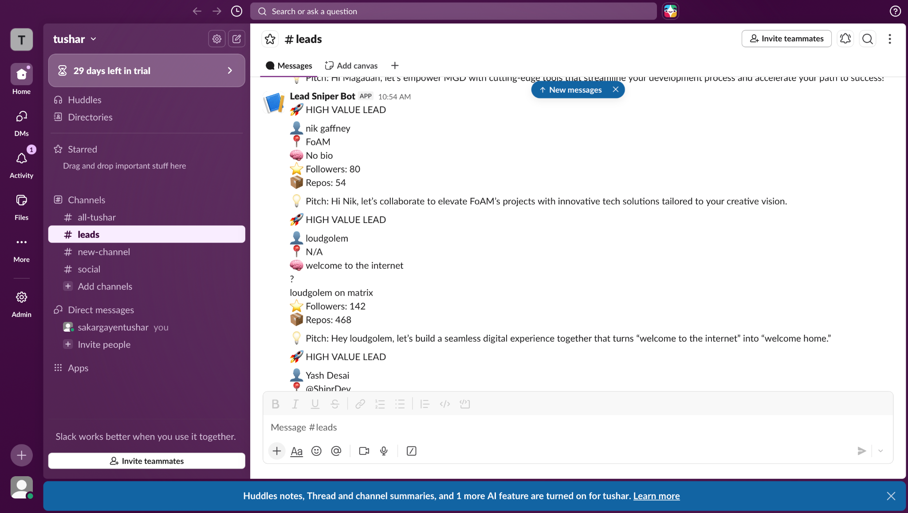

# 🚀 Lead Sniper – AI-Powered GitHub Lead Tracker

## 📌 Overview
Lead Sniper is an automated workflow built using **n8n** that identifies high-value GitHub users, enriches their profile, and generates AI-powered outreach messages sent directly to Slack.

---

## ⚙️ Features

- 🔍 Tracks GitHub Stargazers
- 📊 Filters high-value developers (followers/repos)
- 🤖 Generates personalized AI pitch
- 💬 Sends real-time Slack alerts
- 🔁 Fully automated pipeline

---

## 🧠 Workflow Logic

1. Fetch stargazers from a GitHub repository  
2. Loop through each user  
3. Fetch detailed profile via GitHub API  
4. Apply filter:
   - Followers > 100 OR Repos > 50  
5. Generate AI-based pitch  
6. Send message to Slack  

---

## 🛠 Tech Stack

- n8n (workflow automation)
- GitHub API
- OpenAI API
- Slack Webhooks

---

## 📷 Screenshot

---

## 📂 Files

- `workflow.json` → n8n export
-  `logic-log.md` → explanation of approach

---

## 🎯 Use Case

Useful for:
- Developer outreach
- SaaS lead generation
- Growth automation

---

## 👨‍💻 Author

**Tushar Sakargayan**
